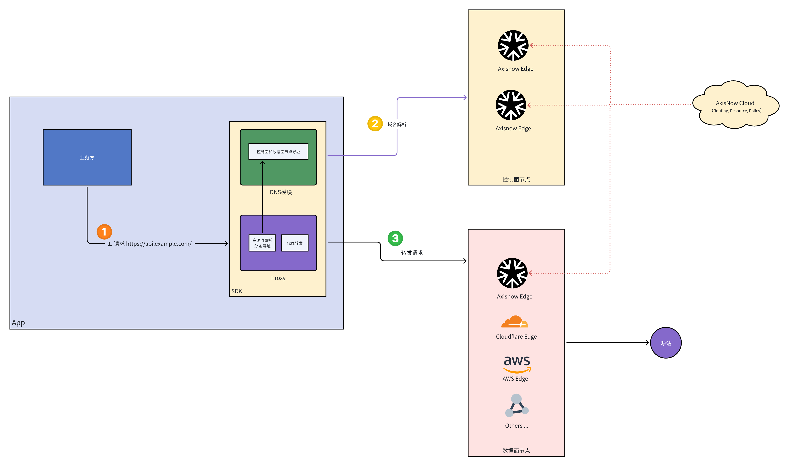
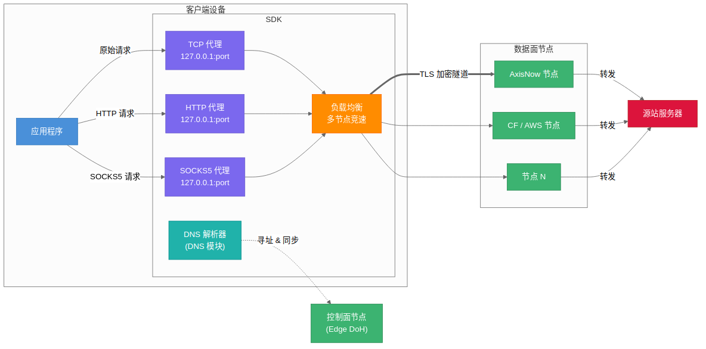
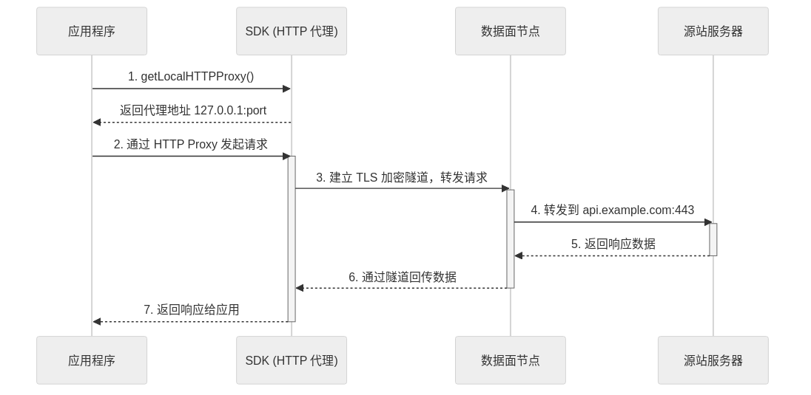
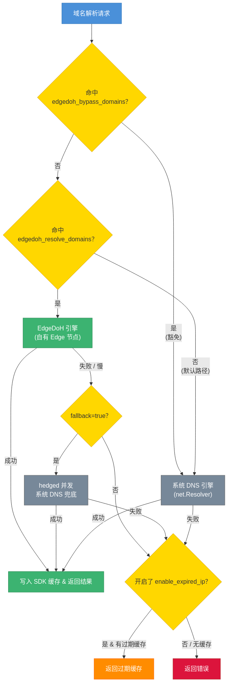

# 架构总览

> **受众**: 应用开发者
> **阅读时间**: 约 10 分钟

本文档从整体架构到各子系统，系统性地介绍 SDK 的工作原理。建议在阅读 [接入指南](../guides/index.md) 之前先浏览本文，建立全局理解。

---

## 目录

- [1. 整体工作流程](#1-整体工作流程)
- [2. SDK 内部组件](#2-sdk-内部组件)
- [3. 代理模式](#3-代理模式)
- [4. 连接建立流程](#4-连接建立流程)
- [5. DNS 解析架构](#5-dns-解析架构)

---

## 1. 整体工作流程

SDK 嵌入到应用中，通过 **控制面节点** 完成寻址，通过 **数据面节点** 完成业务流量转发。两类节点互相独立，由 **AxisNow Cloud** 下发路由规则并做可用性拨测。下图展示端到端关系：

### SDK（客户端核心）

SDK 是整个方案在端侧的执行体，由两个核心模块组成：

| 模块 | 职责 |
|------|------|
| **DNS 模块** | 寻址控制面节点；从控制面同步数据面地址；为 Proxy 模块下发目标数据面地址 |
| **Proxy 模块** | 在设备本地监听（TCP / HTTP / SOCKS5），对业务流量按资源配置分流转发 |

Proxy 模块按请求域名是否命中 Cloud 下发的资源配置做分流：

- **配资源**：流量经 TLS 加密隧道转发到数据面节点，由数据面节点中转到源站
- **不配资源**：流量按常规路径直达源站，不经过数据面

应用无需感知底层细节，只需将请求发往 SDK 提供的本地代理地址即可。

### 控制面节点（Edge DoH）

用户可自部署的 DoH 服务节点，负责：

- 基于设备/区域/资源上下文为 SDK 返回数据面节点地址
- 下发资源路由规则（哪些域名需要代理、转发到哪个数据面）
- 接收 SDK 上报的遥测数据

控制面节点是可靠性关键路径，SDK 内置 EIP + 兜底域名的多层寻址策略保证其可达（详见 [6. DNS 解析架构](#5-dns-解析架构)）。

### 数据面节点

用于资源代理转发、链路加密与请求签名/验签。支持混部：

- **AxisNow 节点**：自动走加密链路，内置签名验证
- **第三方节点（CF / AWS 等）**：HTTP/S 流量 SDK 自动加签名，源站侧可选验证；TCP 流量透明转发

同一资源可根据设备、区域等条件在多个数据面之间灵活路由。

### AxisNow Cloud

整个系统的管控中心，对 SDK **透明**（SDK 不直接通信，一切通过控制面下发）：

- **Routing**：控制面寻址规则 + 资源到数据面的路由规则
- **Resource**：资源（域名/端口）的定义与启停
- **Policy**：链路加密、签名验证等策略配置

同时对控制面/数据面节点做周期性拨测，供路由决策时剔除不可用地址。

> SDK 与 Cloud 之间不直接通信。所有下发均经控制面节点中转，因此即使 Cloud 短暂不可达，SDK 仍可依赖本地缓存的路由规则继续工作。

---

## 2. SDK 内部组件

§1 描述了端到端架构，本节聚焦 SDK 内部各组件之间的关系。

SDK 在设备本地启动三种代理监听（TCP / HTTP / SOCKS5），应用流量经 **负载均衡** 选择最优数据面节点后，通过 **TLS 加密隧道** 转发。**DNS 解析器（DNS 模块）** 独立于代理链路，负责与控制面节点通信完成寻址。

各组件的详细说明：

- **代理模式与接入方式** → [§3 代理模式](#3-代理模式)
- **TLS 隧道建立** → [§4 连接建立流程](#4-连接建立流程)
- **DNS 解析引擎与策略** → [§5 DNS 解析架构](#5-dns-解析架构)

---

## 3. 代理模式

SDK 提供三种代理模式，适用于不同的接入场景。选择合适的模式可以简化集成工作。

### 模式对比

| 特性 | TCP 代理 | HTTP 代理 | SOCKS5 代理 |
|------|---------|----------|------------|
| **接口** | `getLocalTCPProxy(host, port)` | `getLocalHTTPProxy()` | `getLocalSocks5Proxy()` |
| **端口分配** | 每个 host:port 独立端口 | 共享单一端口 | 共享单一端口 |
| **协议支持** | 任意 TCP | HTTP/HTTPS | 任意 TCP |
| **接入方式** | 替换连接目标地址 | 配置为 HTTP Proxy | 配置为 SOCKS5 Proxy |
| **适用场景** | Socket 编程、自定义协议 | HTTP 客户端库 | 通用代理需求 |

### 选择建议

- **HTTP 代理**（推荐优先使用）：如果应用使用 OkHttp、URLSession、Dio 等 HTTP 客户端库，且支持设置代理，这是最简单的接入方式。
- **SOCKS5 代理**：如果需要代理非 HTTP 协议的流量（如 WebSocket、自定义 TCP 协议），且网络库支持 SOCKS5。
- **TCP 代理**：如果需要对特定的 host:port 进行精细控制，或网络库不支持标准代理协议。这是最灵活但接入成本最高的模式。

---

## 4. 连接建立流程

以 HTTP 代理（推荐方式）为例，下图展示了从应用发起请求到收到响应的完整流程：

**流程说明**：

1. **获取代理地址**：应用调用 `getLocalHTTPProxy()`，SDK 返回本地代理地址（如 `127.0.0.1:port`）。

2. **发起请求**：应用将 HTTP 客户端库的代理设为该地址，正常发起请求即可。

3. **加密转发**：SDK 自动与数据面节点建立 TLS 加密隧道，将请求转发至数据面。

4. **到达源站**：数据面节点将请求转发到真实目标 `api.example.com:443`，响应数据沿隧道原路返回。

整个过程对应用来说是透明的——只需配置一次代理地址，后续所有请求的读写方式与直连完全一致。

---

## 5. DNS 解析架构

SDK 内置了完整的 DNS 解析系统，支持通过 Edge 节点进行安全的域名解析（DNS-over-HTTPS），避免 DNS 劫持和污染。

### 对外解析路径

SDK 对外只暴露两条解析路径：

| 引擎 | 触发条件 | 说明 |
|------|----------|------|
| **EdgeDoH** | 域名命中 `edgedoh_resolve_domains` 且未命中 `edgedoh_bypass_domains` | 自有 Edge 节点 DoH，AccessKey 签名认证，返回 `IsEIP` 元数据 |
| **系统 DNS** | 默认路径；命中 `edgedoh_bypass_domains` 也走此路径 | OS `net.Resolver`，受系统 DNS 配置影响 |

### 域名路由（白名单 + 黑名单豁免）

通过两个域名列表控制：

- **白名单**（`edgedoh_resolve_domains`）：命中则走 EdgeDoH
- **黑名单豁免**（`edgedoh_bypass_domains`）：命中则强制走系统 DNS，**优先于白名单**

匹配支持精确域名和 `*.suffix` 通配；优先级：**bypass > resolve > 默认系统 DNS**。

bypass 的存在是为了支持"`*.example.com` 全走 EdgeDoH 但 `login.example.com` 例外"这类场景。

### 容错机制

- **fallback**：命中 EdgeDoH 的域名解析失败时，hedged 兜底到系统 DNS（仅 EdgeDoH 路径生效）
- **过期缓存**：解析失败时，可返回已过期的缓存结果作为降级（两条路径都生效）
- **缓存 TTL**：可配置 TTL 的上下限，平衡解析延迟和数据新鲜度（两条路径统一生效）

> **详细配置**请参阅 [DNS 配置指南](dns.md)。
