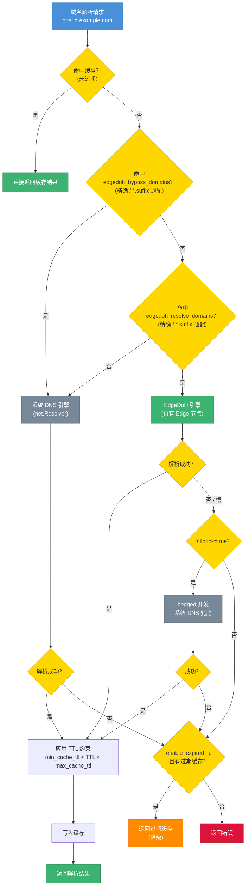

# DNS 配置指南

> **受众**: 需要自定义 DNS 解析行为的应用开发者
> **前置阅读**: [架构总览 - DNS 解析架构](architecture.md#5-dns-解析架构)

---

## 目录

- [1. 解析流程](#1-解析流程)
- [2. DNS 引擎概览](#2-dns-引擎概览)
- [3. EdgeDoH 路由配置](#3-edgedoh-路由配置)
- [4. 缓存配置](#4-缓存配置)
- [5. 预解析](#5-预解析)
- [6. 配置示例](#6-配置示例)

---

## 1. 解析流程

下图展示了一个域名从请求到返回结果的完整解析流程，包括缓存查询、路由判断、引擎解析和容错降级：



**关键流程节点**：

1. **缓存查询**：首先检查是否有未过期的缓存结果，命中则直接返回
2. **路由判断**：依次检查 `edgedoh_bypass_domains` → `edgedoh_resolve_domains`
   - 命中 bypass：走系统 DNS（豁免 EdgeDoH，不触发 fallback）
   - 命中 resolve：走 EdgeDoH，`fallback=true` 时 1s 后并发启动系统 DNS hedged 兜底
   - 都不命中：走系统 DNS（默认路径）
3. **TTL 处理**：对解析结果应用 TTL 约束（`min_cache_ttl` ≤ TTL ≤ `max_cache_ttl`），写入缓存
4. **容错降级**：解析失败时，依次尝试 fallback（仅 EdgeDoH 路径） → 过期缓存 → 返回错误

两条路径（EdgeDoH 与系统 DNS）共用同一份 SDK 缓存表，缓存配置对两条路径统一生效。

---

## 2. DNS 引擎概览

对外只有两条解析路径：

### 2.1 EdgeDoH 引擎

通过 SDK 自有的 Edge 节点进行 DNS-over-HTTPS 解析。

```
请求 → Edge DoH 引擎
         ├─ 成功 → 写缓存返回
         └─ 失败 → 若 fallback=true → 系统 DNS 兜底（hedged） → 返回结果或错误
```

**特点**：
- 使用 AccessKey 签名认证，解析请求经加密传输
- 防止 DNS 劫持和污染
- 返回结果带 EIP 元数据（`IsEIP`），供 SecureProxy 决策使用
- 需要 Edge 节点可达；不可达时由 fallback 接管

**适用场景**：业务域名解析、需要防劫持/防污染的关键域名。

### 2.2 系统 DNS 引擎

直接使用操作系统配置的 DNS 解析器（`/etc/resolv.conf` / Android `getaddrinfo` / iOS `SCDynamicStore` 等）。

```
请求 → 系统 DNS → 返回结果或错误
```

**特点**：
- 零额外依赖
- 受系统 DNS 配置影响（可能被劫持、可能被运营商污染）
- 不携带 EIP 元数据
- 同时是 EdgeDoH 路径的兜底引擎（`fallback=true` 时）

**适用场景**：未配置 EdgeDoH 的域名（默认路径）、内网域名（仅内网 DNS 能解析）、调试环境。

---

## 3. EdgeDoH 路由配置

通过 `dns.edgedoh_resolve_domains` 把希望经 EdgeDoH 解析的域名加入白名单；通过 `dns.edgedoh_bypass_domains` 把白名单中需要豁免的特定域名转回系统 DNS。

### 3.1 匹配优先级

```
edgedoh_bypass_domains（精确 / 通配符） > edgedoh_resolve_domains（精确 / 通配符） > 系统 DNS（默认）
```

bypass 优先于 resolve 是为了支持"`*.example.com` 全走 EdgeDoH 但 `login.example.com` 例外"这类场景，无需逐一枚举子域名白名单。

### 3.2 通配符规则

支持 `*.suffix` 形式的通配，例如 `*.example.com` 匹配 `api.example.com` / `cdn.example.com`，但**不匹配** `example.com` 自身。要同时覆盖根域名和子域名，把两者都加进列表：

```json
{
  "edgedoh_resolve_domains": ["example.com", "*.example.com"]
}
```

### 3.3 配置示例

**白名单 + 黑名单豁免**：

```json
{
  "dns": {
    "edgedoh_resolve_domains": ["*.example.com"],
    "edgedoh_bypass_domains": ["login.example.com"]
  }
}
```

行为：
- `api.example.com` / `cdn.example.com` → 走 EdgeDoH
- `login.example.com` → 走系统 DNS（被 bypass 豁免）
- `other.com` → 走系统 DNS（未命中白名单）

> 各平台 wrapper 的具体方法名（如 Android `Config.Builder.addEdgeDoHResolveDomain()` 等）以各平台 SDK 文档为准——本指南给出的 JSON 是协议层的统一表示。

---

## 4. 缓存配置

DNS 缓存可以显著减少重复解析的延迟，对 EdgeDoH 与系统 DNS 两条路径**统一生效**——所有解析结果都进同一份 SDK 缓存表。

### 4.1 参数说明

| 参数 | 类型 | 默认值 | 范围 | 说明 |
|------|------|--------|------|------|
| `fallback` | bool | `true` | - | 命中 EdgeDoH 的域名解析失败时，是否 hedged 兜底到系统 DNS。**仅对命中 EdgeDoH 的域名生效**。 |
| `enable_expired_ip` | bool | `true` | - | 解析失败时是否允许返回已过期的缓存 IP（两条路径都生效） |
| `timeout_millis` | int | `10000` | 最小 1000 | 单次解析端到端超时（毫秒），包含重试和 hedged fallback |
| `min_cache_ttl` | int | `60` | 最小 5 秒 | 缓存 TTL 下限，DNS 响应中低于此值的 TTL 会被提升到此值；响应无 TTL 时也使用此值 |
| `max_cache_ttl` | int | `300` | 最大 600 秒 | 缓存 TTL 上限，高于此值的 TTL 会被截断 |
| `negative_cache_ttl` | int | `10` | - | 否定响应（NXDOMAIN 域名不存在 / NODATA 无匹配记录）的缓存时长（秒） |

### 4.2 调优建议

| 场景 | 建议配置 |
|------|---------|
| **首屏加速** | 提高 `min_cache_ttl`（如 120 秒），减少 DNS 查询次数 |
| **域名 IP 变更频繁** | 降低 `max_cache_ttl`（如 120 秒），确保及时获取新 IP |
| **网络环境不稳定** | 开启 `enable_expired_ip`（默认已开启），网络抖动时仍可使用过期缓存 IP |
| **域名偶尔不存在或无记录** | 降低 `negative_cache_ttl`（如 5 秒），避免长时间缓存否定结果（NXDOMAIN / NODATA） |

---

## 5. 预解析

通过 `pre_resolve_hosts` 配置，SDK 在初始化时会在后台预解析指定域名，将结果提前写入缓存。

### 5.1 作用

- 消除首次请求的 DNS 延迟
- 适用于应用启动后必定会访问的域名

### 5.2 配置方式

```json
{
  "dns": {
    "pre_resolve_hosts": ["api.example.com", "cdn.example.com", "auth.example.com"]
  }
}
```

预解析结果按路由规则自动分发到对应引擎——`pre_resolve_hosts` **不必是 `edgedoh_resolve_domains` 的子集**。在 `edgedoh_resolve_domains` 中的域名预解析走 EdgeDoH，否则走系统 DNS，结果都写入 SDK 缓存。

### 5.3 最佳实践

- 只放**启动后一定会访问**的域名，避免不必要的解析开销
- 域名数量建议控制在 **10 个以内**
- 预解析是**后台异步**执行的，不会阻塞 SDK 初始化

---

## 6. 配置示例

### 6.1 最简配置（所有域名走系统 DNS）

不显式启用 EdgeDoH 时，业务域名解析行为与未集成 SDK 时一致：

```json
{
  "access_key_id": "ak_xxx",
  "access_key_secret": "sk_xxx",
  "edge_addresses": ["edge.example.com"]
}
```

默认行为：
- 业务域名一律走系统 DNS（不经 EdgeDoH）
- 开启 `enable_expired_ip`（解析失败时允许使用过期缓存 IP）
- 不预解析任何域名
- 缓存 TTL：60-300 秒
- `edge_addresses` 中的控制面节点地址由 SDK 内部寻址机制处理（与对外 DNS 配置无关）

### 6.2 典型生产配置（业务域名走 EdgeDoH + 部分豁免 + 预解析）

为受保护的业务域名启用 EdgeDoH，对登录域名豁免（防止后端策略冲突），开启 fallback 与预解析：

```json
{
  "access_key_id": "ak_xxx",
  "access_key_secret": "sk_xxx",
  "edge_addresses": ["edge1.example.com", "edge2.example.com"],
  "dns": {
    "edgedoh_resolve_domains": ["*.example.com"],
    "edgedoh_bypass_domains": ["login.example.com"],
    "fallback": true,
    "enable_expired_ip": true,
    "timeout_millis": 10000,
    "pre_resolve_hosts": ["api.example.com", "cdn.example.com"]
  }
}
```

### 6.3 仅启用部分关键域名（无豁免）

只为最关键的几个 API 域名启用 EdgeDoH，其他全部走系统 DNS：

```json
{
  "access_key_id": "ak_xxx",
  "access_key_secret": "sk_xxx",
  "edge_addresses": ["edge.example.com"],
  "dns": {
    "edgedoh_resolve_domains": ["api.example.com", "auth.example.com"],
    "fallback": true
  }
}
```
