# AxisNow 移动/原生应用增强套件白皮书

## 前言

在今天的数字世界，移动应用、桌面客户端、工作负载和 IoT 设备正在成为组织核心业务的主要承载形态。然而，传统面向"域名"和"网站"设计的安全加速产品（如 Cloudflare、腾讯云 EdgeOne、阿里云 ESA 等），已经难以充分满足端应用对**安全、速度和高可用**的更高诉求。

为了让您快速且深入地理解 AxisNow 移动/原生应用增强套件（以下简称 SDK 或 AxisNow）的重要性和对应的解决方案，本文将详细阐述其面临的挑战、设计理念、技术架构与典型应用场景。

## 什么是 AxisNow 移动/原生应用增强套件？

AxisNow 移动/原生应用增强套件是一项面向多端应用（包括但不限于：手机 App、PC 端应用、IoT 设备等）的**域名解析和安全加速服务**。它通过在客户端集成轻量级 SDK，并与 **AxisNow 或第三方的边缘网络**协同工作，为应用服务带来更强的**安全、速度和高可用**。

不同于传统 CDN 和 WAF 仅作用于服务端域名，AxisNow 将"信任锚点"前移到了应用本身——SDK 在客户端完成可信认证、智能路由、加密通道建立、运行环境检测等关键工作，与边缘网络一起形成**端到端的协同防护与加速**体系。

简而言之，AxisNow 是一款由**应用内嵌 SDK + 全球边缘网络**协同工作的下一代端到端安全加速产品。它综合了 **DNS、WAF、CDN、零信任 (Zero Trust) 和 SASE** 的核心能力，并针对多端应用场景进行了深度优化。

## 当前面临的问题和解决方案

传统的安全加速产品（Cloudflare、腾讯云 EdgeOne、阿里云 ESA、AWS CloudFront 等）的设计前提是"以域名为单位"——将域名 DNS 接入云服务商后，统一获得安全与加速能力。这一基于"中心化 DNS + 公开云节点"的体系，在 PC 互联网时代取得了巨大成功，但也存在以下结构性问题：

- **域名劫持和屏蔽风险高，缓解成本巨大**：DNS 协议的明文传输特性使其极易被中间链路劫持、污染甚至屏蔽。在跨境、运营商劫持、地区性 DNS 污染等场景下，常规做法是**采用大批量域名轮询**来缓解，但这一方式存在巨大的运营成本。
- **基于 DNS 或 BGP 的路由是粗粒度和有时效性的**：DNS 解析以"域名 → IP"为单位，TTL 通常以分钟乃至小时为周期；BGP Anycast 路由以路由前缀为单位。这意味着无法针对单个用户、单个请求做精细化调度；节点故障时，DNS 切换存在长达数分钟的传播延迟；不同运营商、不同地区的最优路径无法实时感知和切换。
- **应用服务是公开暴露的，你需要随时应对攻击**：传统模式下，应用服务必须暴露公网 IP 与开放端口，所有的请求（包括恶意流量）都会到达边缘节点，再依靠 WAF / Bot / 速率控制被动过滤。这意味着：DDoS / CC 攻击的攻击面始终存在，攻击者可以反复探测、压测、试错，防御策略永远是"事后补救"，成本高且滞后。
- **单一 CDN 风险和节点分布的局限性**：如果您将业务绑定在单一 CDN，一旦提供商出问题或在某地区节点故障，业务侧几乎没有手段补救。同时公共 CDN 的"快"是相对全局用户的平均最优，企业无法针对自己的用户群体进行**主动调优**。

## AxisNow 应运而生

随着移动应用、IoT、桌面客户端在业务中的占比不断提升，我们观察到以下新趋势：

- **客户端可控**：企业可以自由集成 SDK 到自己的应用中，从而把"信任与策略"延伸到客户端
- **API 化业务**：业务流量越来越多以 API 调用呈现，而不是传统的页面访问
- **跨境与全球化**：用户分布更广，对路径优化和合规要求更高
- **零信任理念普及**：基于身份与设备的访问控制成为主流安全范式

这些趋势使得"基于客户端 SDK + 边缘网络"的协同方案具备了前所未有的可行性与必要性——**这正是 AxisNow 出现的根本背景**。

### 设计理念

AxisNow 的核心设计理念可以概括为以下 4 条原则：

1. **客户端即第一道防线**：通过在 App、PC 客户端、IoT 设备中集成 SDK，将访问验证、运行环境检测、加密通信、智能路由等关键能力前置到客户端。攻击者在尚未触达服务端时，就已经被识别和拦截。
2. **服务从公开暴露走向"按信任开放"**：借鉴零信任 (Zero Trust) 的思想，边缘网络不再直接通过 DNS 暴露节点 IP，而是仅对通过信任的合法 SDK 客户端开放。这从根本上消除了大部分攻击面。攻击者无法攻击他看不见的东西。
3. **端到端可观测**：SDK 与边缘网络全程打点、采样并回传遥测数据，提供端到端的全链路可观测能力，帮助企业以"用户视角"实时感知服务质量。
4. **多云边缘可灵活组合**：AxisNow 不绑定任何特定的边缘网络。我们认为 CDN 已经高度商品化，而真正的差异化价值来源于**客户端 SDK + 控制平面**。

### 核心能力矩阵

AxisNow 综合了多项技术能力，可以理解为一款需要客户端配合的下一代安全加速产品：

| 能力维度 | 传统产品 | AxisNow 的演进 |
|---|---|---|
| 域名解析 | DNS / HTTPDNS | 基于上下文的、去中心的 DoH & HTTPDNS |
| 应用安全加速 | CDN / WAF | 支持 AxisNow 边缘和公共 CDN |
| 网络安全加速 | VPN / SD-WAN | 应用级的网络安全隧道（仅 AxisNow Edge 支持） |
| 业务安全 | RASP / 移动安全加固 | 应用完整性、密钥保护、设备风控、零信任应用可信访问 |
| 体验监控 | APM / DEM | 端侧真实用户体验全链路可视化 |

## 带来的收益

集成 AxisNow SDK 后，您的应用与业务可以获得以下核心收益：

**一、显著降低被攻击的风险与成本**：通过将业务从公网"隐身"，DDoS、CC、爬虫、未授权 API 调用等攻击面被大幅缩小。攻击者无法直接寻址所有攻击目标，只能面对边缘网络与 SDK 双重信任校验，**且很容易暴露攻击者自己**。

**二、消除域名劫持与屏蔽带来的不可用风险**：SDK 内置加密 DNS 解析、基于上下文与分布式解析机制，无需依赖大量轮询域名即可保障在复杂网络环境下（跨境、运营商劫持、弱网）的高可用，显著降低运维与采购成本。

**三、保护移动应用的业务核心资产**：SDK 内置应用完整性校验 (App Attestation)、API 密钥保护、证书绑定 (Certificate Pinning)、设备环境检测（越狱 / Root / 模拟器 / 调试 / Hook 框架）等能力，全方位保护 API、密钥和业务逻辑不被篡改、仿冒和滥用。

**四、显著提升全球用户的访问速度**：通过应用级智能路由、TCP / QUIC 多路径优选、就近边缘接入与连接复用，跨境、跨运营商场景下的访问延迟和成功率获得明显改善。

**五、获得主动数字体验感知能力**：全链路埋点与遥测让运维与业务团队能够"以用户视角"实时观测服务质量，主动定位故障、量化优化效果。

**六、低集成成本、可自助部署**：SDK 设计精简，主流端平台（iOS / Android / Windows / macOS / Linux / 主流 IoT 平台）均提供原生支持，集成无需重写业务代码。整套服务可在 1 小时内完成初始化部署。

**七、不绑定特定边缘，保护已有 CDN 投资**：AxisNow 的 SDK 与控制平面与边缘网络解耦。如果您已经在使用 Cloudflare、阿里云 ESA、腾讯云 EdgeOne 等 CDN，可以**继续沿用现有合约和节点**，同时通过 AxisNow 获得 HTTPDNS、可信访问、业务安全、体验观测等所有增强能力——无需迁移流量，无需推翻原有架构。同时也可以选择性地接入 AxisNow 自有边缘以获得更深度的能力，或者**多边缘混合部署**以应对地区合规、灾备和成本优化诉求。

## 技术架构

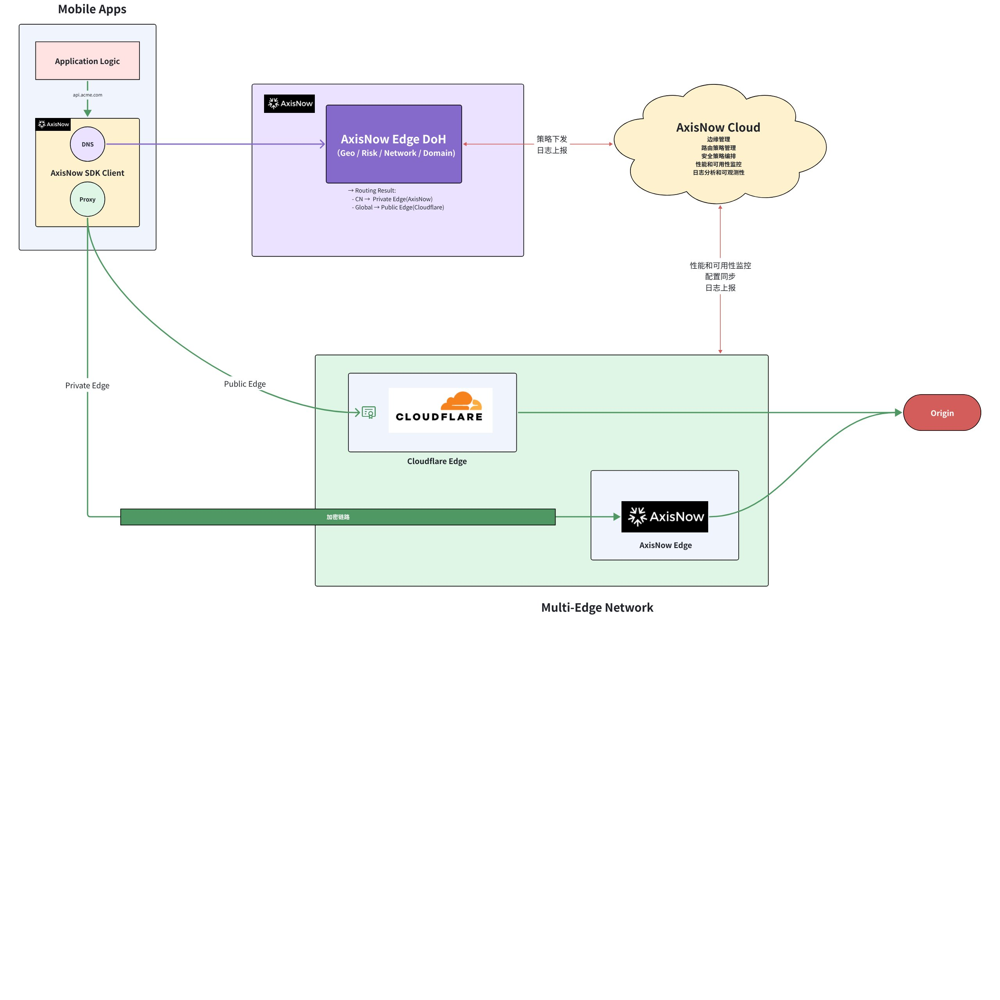

AxisNow 移动/原生应用增强套件由 **AxisNow SDK Client**、**AxisNow Edge DoH**、**Multi-Edge Network（数据面）**、**AxisNow Cloud（控制面）** 三个核心部分组成。三者协同工作，将传统依赖 DNS 和公开域名入口的访问模式，升级为由客户端可信接入、边缘智能调度和控制面统一编排共同驱动的端到端安全加速体系。

### AxisNow SDK Client：应用内的可信接入与智能调度代理

AxisNow SDK Client（简称 SDK）集成在移动 App、桌面客户端或 IoT 设备中，负责在请求发起前完成本地决策与可信接入。它不仅是应用侧的接入 SDK，同时也是运行在应用内部的轻量级 DNS 与智能代理层。

不同于传统依赖操作系统 DNS 和固定公网入口的模式，SDK 可以直接在客户端侧完成接入点发现、动态路由、连接切换与安全接入控制，从而让应用具备更强的可用性、安全性与网络控制能力。SDK 主要承担如下职责：

- 内置 Edge DoH 能力，实现可信解析、接入点发现，并获取和缓存控制面下发的服务配置
- 完成设备、应用版本、运行环境等可信校验
- 管理应用内连接路由与 Proxy 转发，根据网络质量、区域、运营商及节点状态动态选择接入路径，与 Multi-Edge 网络建立可信连接
- 在节点异常、链路质量下降或域名不可用时快速切换，支持客户端侧的连接容灾与去中心化接入
- 支持加密 DNS 与抗 DNS 劫持，提升复杂网络环境下的接入稳定性

### Multi-Edge 网络：安全加速与流量治理执行层

Multi-Edge 网络是 SDK 请求进入业务系统前的边缘执行层，负责流量接入、安全防护与回源转发。与传统 CDN/WAF 仅基于公开域名处理请求不同，Multi-Edge 网络结合 SDK 传递的可信上下文，对请求进行更精细化的识别、调度和安全控制。

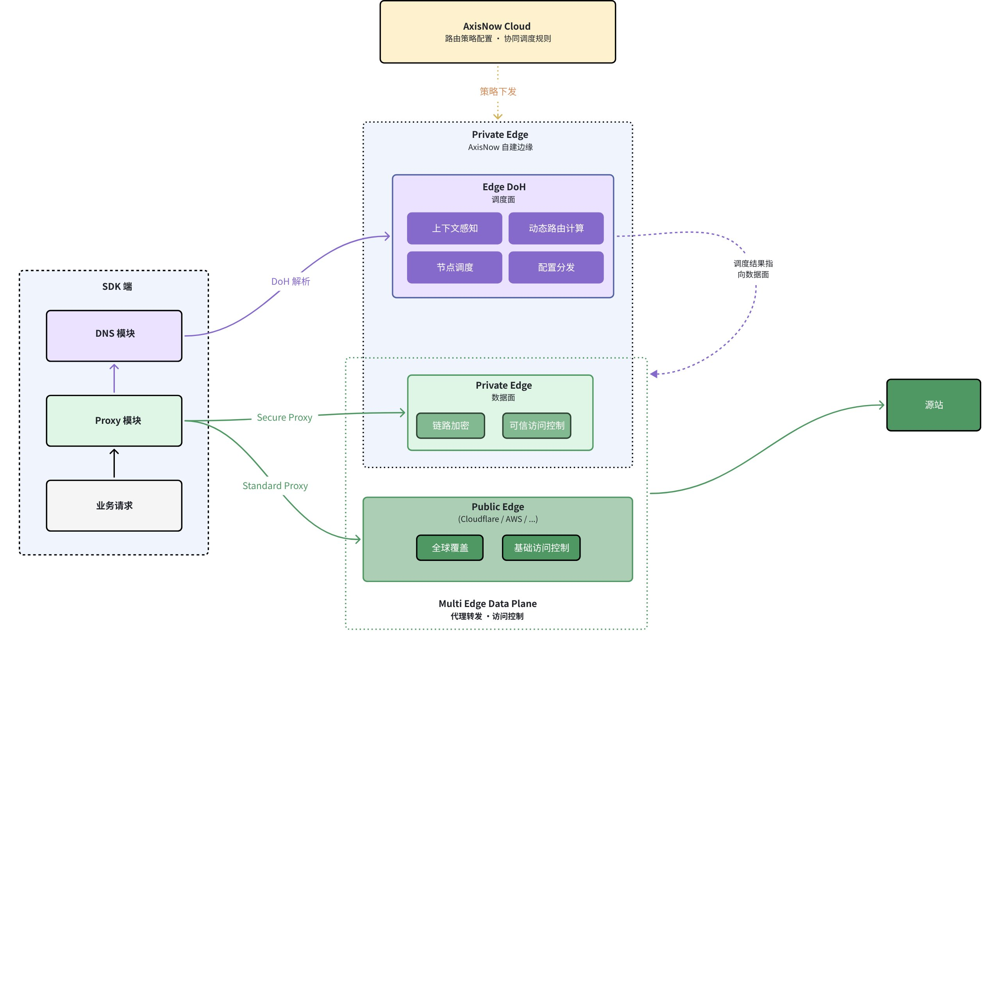

Multi-Edge 网络由两类节点组成，各司其职：

**Private Edge**（AxisNow 自建边缘）是 Multi-Edge 网络中的可信接入与调度核心，承担调度面与数据面的双重职责：

- **调度面（Edge DoH）**：运行 Edge DoH 服务，负责基于设备上下文的域名解析与路由决策、SDK 接入点发现与动态路由协同。Edge DoH 分布在每个 Private Edge 节点上，每个节点都能独立完成上下文路由计算，无需依赖中心化调度服务。同时，Edge DoH 也是 SDK 与控制面之间的通信中转——SDK 通过 Edge DoH 获取控制面下发的配置与策略，而非直接连接控制面
- **数据面**：提供 TLS/加密链路接入、基于上下文的请求认证与可信校验、WAF/Bot 防护/访问控制/速率控制等深度安全能力，以及智能回源、故障切换与协议优化

**Public Edge**（第三方公有 CDN，如 Cloudflare、AWS CloudFront）：不运行 Edge DoH，其流量调度完全由 Private Edge 上的 Edge DoH 决定。仅承担数据面职责：

- 提供公网接入、缓存加速、标准回源与协议优化等全球加速能力
- 通过 JWT Token 校验实现基础访问控制

Private Edge 和 Public Edge 虽然安全能力不同，但都承担流量转发职责——这一共享的转发层在后文中统称为 **Data Plane（数据面）**。

控制面持续采集两类节点的日志、指标、链路质量与安全事件数据，形成完整的可观测性闭环。

### 控制面：策略编排、配置分发与全局观测中心

控制面负责 Edge 管理、SDK 集成、策略编排、配置分发与全局可观测性，是整个动态接入体系的统一管理与协同中心。

控制面不直接参与业务流量转发，而是负责管理 SDK 与 Multi-Edge 网络之间的配置、策略与运行状态。

控制面主要提供：

- 域名、源站和边缘节点管理
- 路由策略与安全策略统一编排与配置下发
- SDK 接入配置与版本策略管理
- 节点健康、链路质量、请求日志及深度可见性分析
- 持续汇聚 SDK 行为、设备风险、边缘性能和链路可用性数据，为 Edge DoH 路由、安全策略和节点调度提供依据
- API、控制台与自动化集成能力

控制面通过持续收集 SDK 与 Multi-Edge 网络的运行状态，形成全局观测视角，为接入、路由与安全策略提供动态决策依据。

### 工作原理

#### 请求链路

一个典型的请求从应用发出到最终收到响应，根据域名是否启用 Edge DoH，会走不同的路径。以下以启用 Edge DoH 的域名为例，依次经历三个阶段：

**阶段一：DoH 调度**。应用发起业务请求后，DNS 模块拦截 DNS 请求并检查目标域名是否在 Edge DoH 配置的域名列表中。若匹配，则通过 Edge DoH 通道发起解析，同时携带设备上下文信息，Edge DoH 结合上下文与控制面下发的路由策略，动态计算并返回一组候选 Data Plane 节点列表，为后续 Proxy 模块的测速择优提供基础；若未匹配，则交由本地默认 DNS 解析。

**阶段二：智能 Proxy**。Proxy 模块收到候选节点列表后，对各节点进行轻量级测速（延迟、丢包、连通性），择优选定接入节点。随后根据目标节点的类型自动选择接入模式：

- 若目标为 Private Edge，SDK 采用 Secure Proxy 模式，通过加密链路接入
- 若目标为 Public Edge，SDK 采用 Standard Proxy 模式，向请求中注入 JWT Token 后转发
- 若 Private Edge 不可用，SDK 自动切换至 Public Edge，保障业务不中断

**阶段三：边缘接入与访问控制**。Data Plane 节点接收请求后，根据接入模式执行不同的可信校验：

- Private Edge：验证加密链路的合法性，并结合 SDK 传递的设备信息、网络环境、应用信息及动态风险评级执行上下文访问控制。安全等级高，支持精细化访问控制
- Public Edge：验证 SDK 注入的 JWT Token 的有效性与完整性，确认请求来自合法的 SDK 客户端。侧重全球覆盖与标准加速能力

校验通过后，边缘节点按配置的回源策略将请求转发至业务后端，响应沿原路返回应用。全过程对上层应用完全透明。

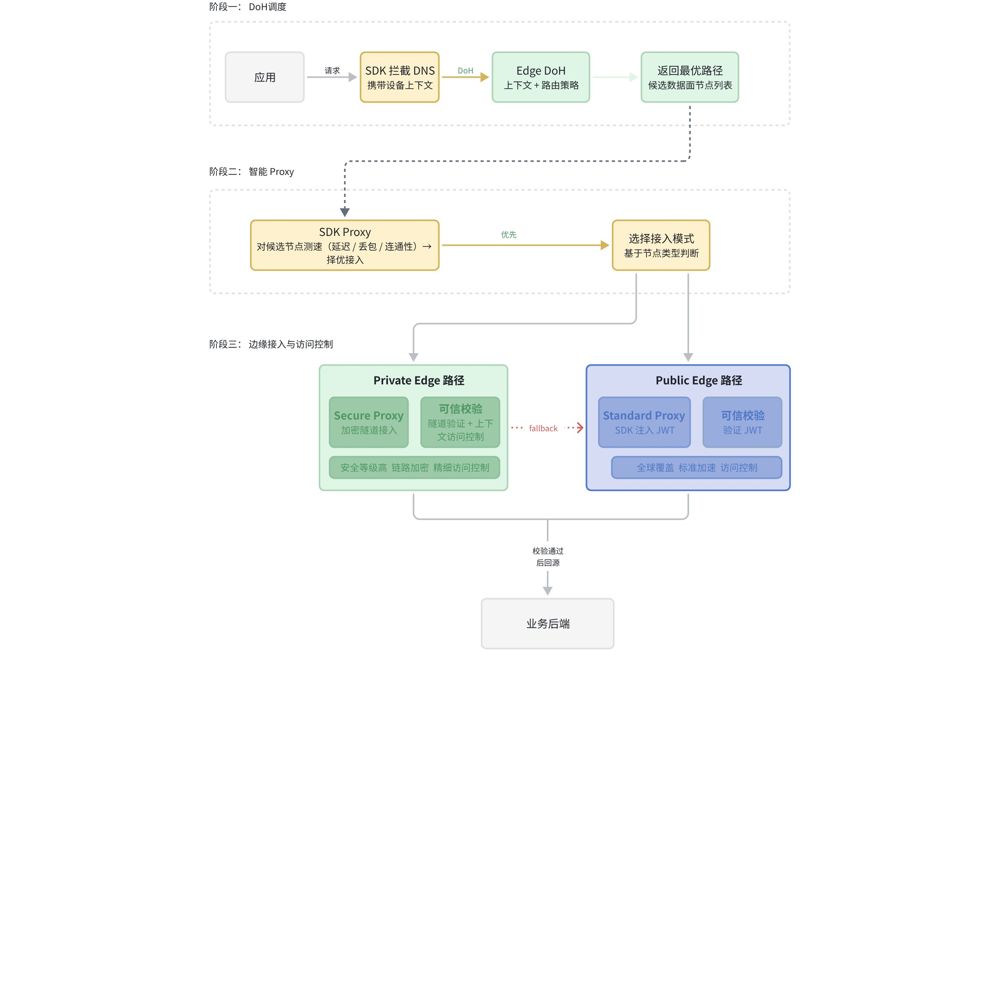

#### 路由机制：业务域名与调度域名

AxisNow 的域名解析体系围绕两类域名展开：**调度域名**和**业务域名**。两者都在 AxisNow Cloud 的 **DoH 插件**中统一配置规则，并由 SDK 内的 DoH 模块统一处理，但解析目标和策略截然不同。

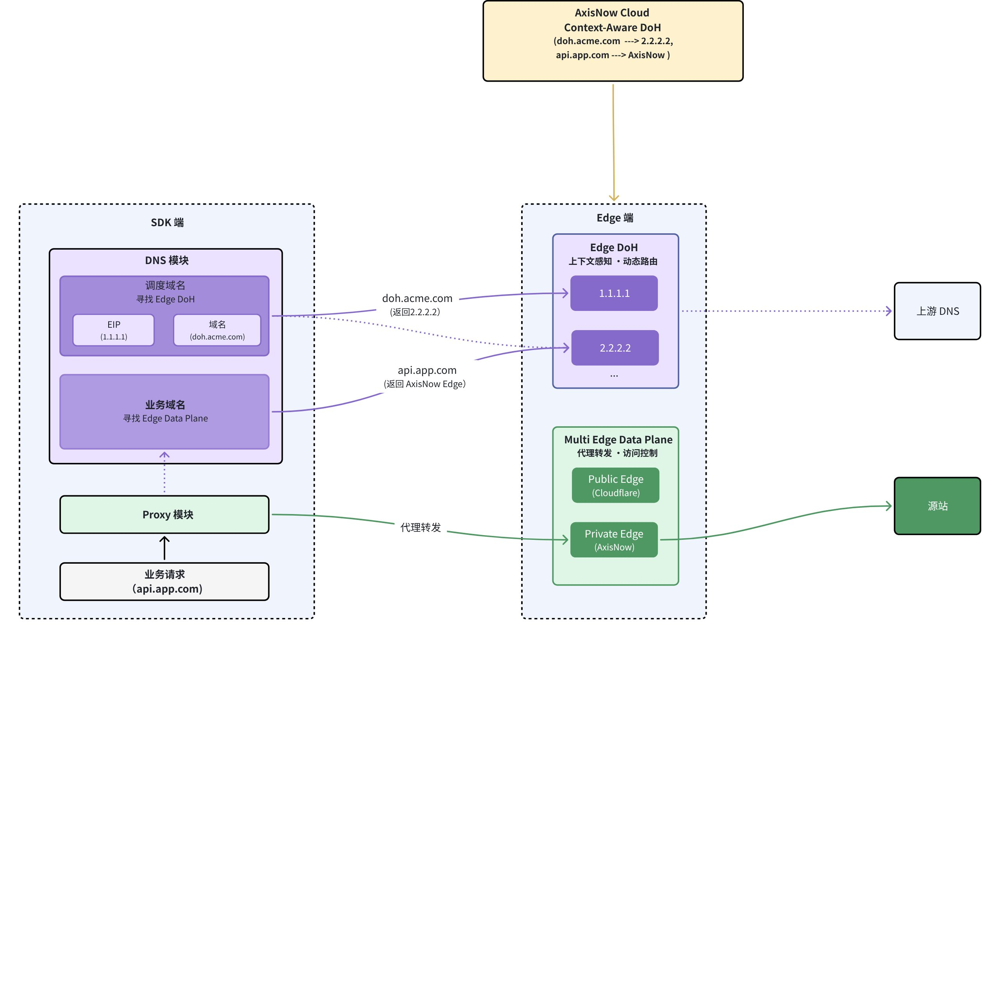

##### 调度域名

调度域名（如 `doh.acme.com`）解决的是"SDK 如何找到 Edge DoH"的问题。它先于任何业务请求被解析，是整个系统的启动前提。

SDK 通过集成参数预配置两类寻址资源，用于初始寻址与极端场景下的兜底（每类可配置多个以保障可用性）：

- **直连 EIP**：如 `1.1.1.1`，无需 DNS 即可直连 Edge DoH，一般用于首次冷启动及 DNS 完全不可用时的极限兜底
- **预配置域名**：如 `doh.acme.com`，通过加密 HTTPDNS 或常规解析获取 Edge DoH 地址

以图中为例，SDK 预先设置 `1.1.1.1` 和 `doh.acme.com`，`doh.acme.com` 通过 `1.1.1.1` 解析后返回 `2.2.2.2`，SDK 即可连接到该 Edge DoH 节点。调度域名追求的是极致可达性——即使 DNS 被劫持、网络受限或首次冷启动，SDK 都能通过 EIP 直连或域名解析找到 Edge DoH。这也意味着 SDK 不直接依赖控制面，而是通过自身内置的寻址资源独立完成与 Edge DoH 的首次连接。

!!! note
    由于 Private Edge 同时承担 Edge DoH 与数据面的双重职责，SDK 初始化配置的节点地址既用于 Edge DoH 寻址，也可直接作为数据面的接入入口。

##### 业务域名

业务域名（如 `api.app.com`）是应用实际访问的目标域名，代表真实的业务流量。

SDK 默认使用本地 DNS 解析所有域名，不改变应用原有的网络行为。开发者可按域名粒度指定哪些域名走 Edge DoH 解析，未指定的域名仍走本地默认解析，对现有业务零影响。这一机制让开发者可以渐进式接入——先对核心业务域名启用 Edge DoH，验证效果后再逐步扩大范围。

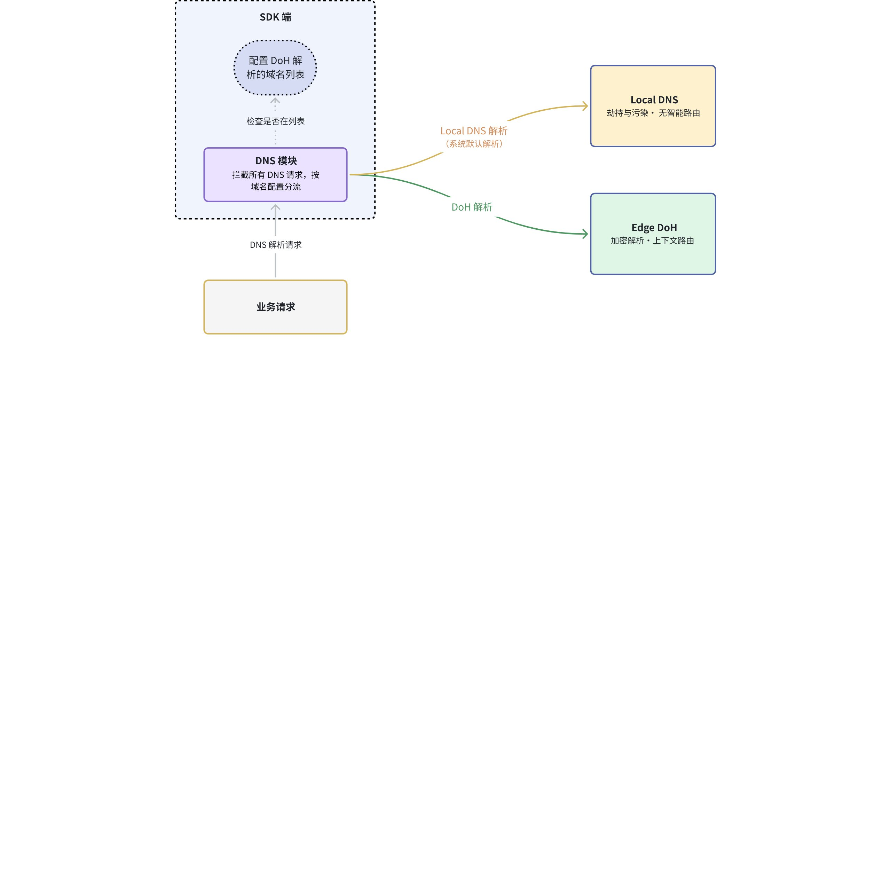

DoH 模块拦截所有 DNS 请求，检查目标域名是否在 Edge DoH 配置的域名列表中。若匹配，则通过已建立的 Edge DoH 通道解析该域名，Edge DoH 结合设备上下文和控制面下发的路由策略，动态返回最优的 Data Plane 节点地址；若未匹配，则交由本地默认 DNS 解析，SDK 不做干预。以图中为例，`api.app.com` 经 Edge DoH 解析后返回 Data Plane 节点的地址（这里是 Private Edge）。

!!! tip "为什么要区分两类域名？"
    因为它们的可用性诉求完全不同。调度域名必须在最恶劣的网络条件下仍然可达，因此需要 EIP 直连和预配置域名的双重兜底；业务域名则需要根据实时上下文做精准调度，因此依赖 Edge DoH 的上下文感知能力。将两者分离，使得 AxisNow 能够用不同的策略分别保障"系统自身的可用性"和"业务流量的最优路径"，互不干扰。

##### 基于上下文的节点隔离

上述业务域名的解析过程中，Edge DoH 携带的设备上下文不仅决定了最优路径，还支撑了节点隔离能力——不同上下文的设备可能被调度到不同的 Edge DoH 节点和 Data Plane 节点。

最典型的场景是基于风险等级的隔离：高风险设备（如越狱设备、模拟器环境、存在代理/VPN 等异常特征）、初次启动尚未建立信任的设备，与正常设备在网络层面被调度到不同的节点池中。高风险或未验证设备无法探知正常设备所使用的边缘节点地址，从而避免攻击者通过受控设备探测和暴露正常业务使用的基础设施。这种隔离在 DNS 解析层面就将威胁流量与正常流量分离，而非等到请求到达边缘节点后才做拦截。

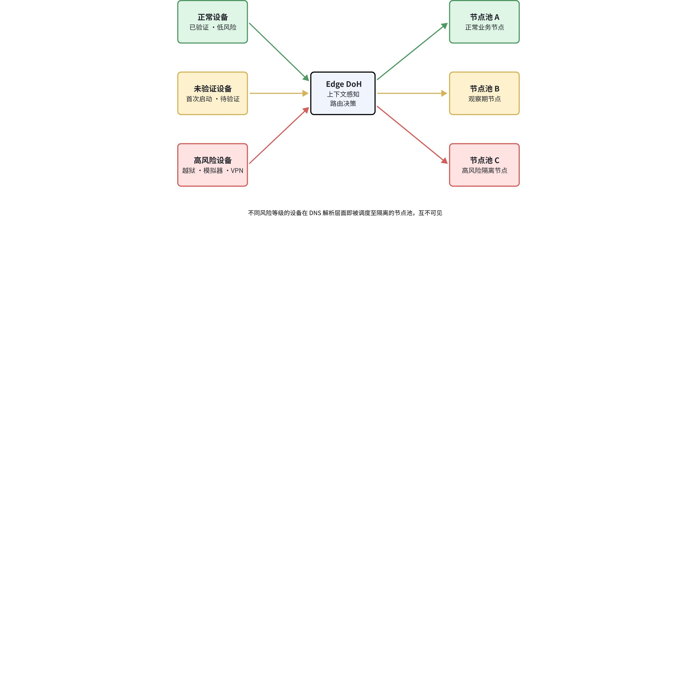

#### 动态接入与故障切换

传统 CDN 依赖 DNS TTL 或 BGP 路由收敛来实现故障切换，切换延迟通常以分钟计。AxisNow 从 SDK 侧和控制面侧两个层面协同保障动态接入与故障切换能力。

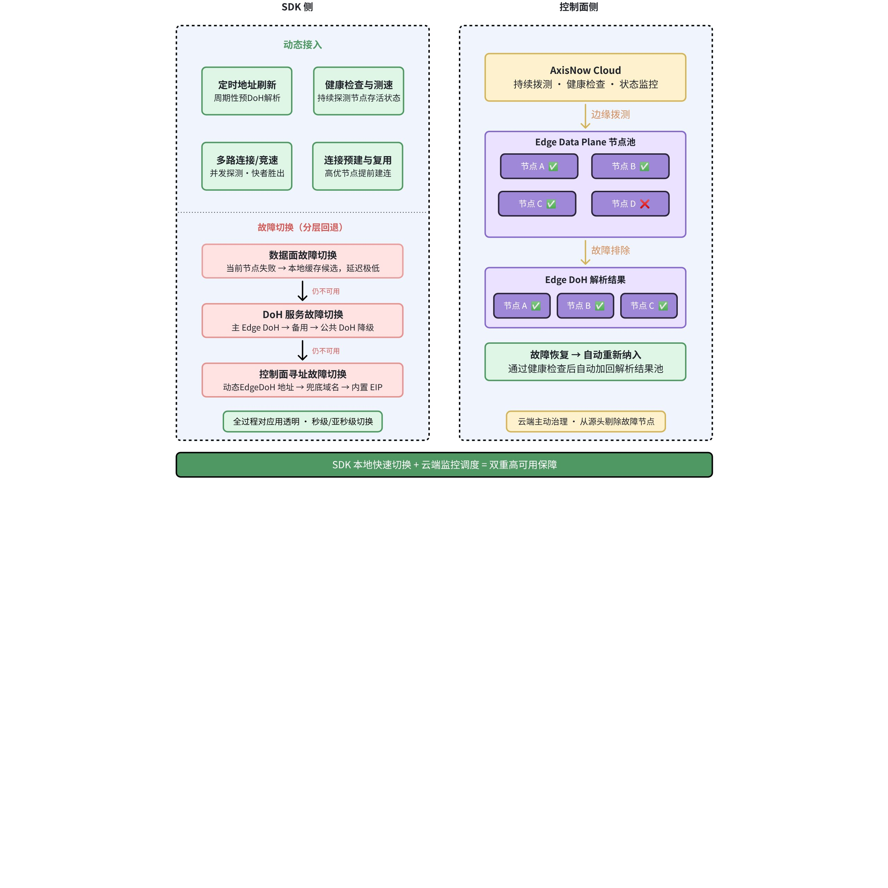

##### SDK 侧：动态接入

SDK 持续维护对 Data Plane 节点的实时感知，确保每个请求都走最优路径：

- 定时地址刷新：SDK 周期性向 Edge DoH 发起预解析，主动更新候选节点列表，确保本地持有的地址始终是最新的
- 健康检查与测速：SDK 持续探测候选节点的存活状态、延迟、丢包率和连通性，量化每个节点的实际质量
- 多路竞速：SDK 可同时向多个候选节点发起并发探测，最快响应者胜出
- 连接预建与复用：SDK 可对高优先级节点预建连接，减少冷启动延迟

##### SDK 侧：故障切换

当节点或链路出现异常时，SDK 按以下层级自动回退，所有切换对上层应用完全透明：

- Data Plane 故障切换：当前节点连接失败、超时或质量劣化时，SDK 立即从本地缓存的候选列表中选择替代节点，无需重新发起 DoH 解析，延迟极低
- Edge DoH 故障切换：当主 Edge DoH 节点不可达时，SDK 自动切换到备用节点；若所有 Edge DoH 均不可达，降级使用第三方公共 DoH 服务（如 Cloudflare DoH、Google DoH）
- Edge DoH 寻址回退：SDK 优先使用动态获取的 Edge DoH 地址；若不可达，回退到兜底域名解析；若仍失败，最终通过预配置 EIP 直连（详见前文调度域名的兜底机制）

##### 控制面侧：云端主动治理

除了 SDK 侧的自主容错，AxisNow Cloud 还对 Data Plane 进行持续监控：

- 可用性监控：AxisNow Cloud 持续对各 Data Plane 节点进行拨测和健康检查，实时掌握每个节点的可用状态和延迟情况
- 故障节点自动摘除：当检测到某个节点出现可用性下降时，自动将其从 Edge DoH 的解析结果中移除，从源头避免流量被调度到不可用的节点
- 恢复自动纳入：当故障节点恢复正常并通过健康检查后，自动重新加入解析结果池，无需人工干预

SDK 侧与控制面侧形成互补：SDK 侧提供秒级甚至亚秒级的客户端本地快速切换，控制面从全局层面主动剔除故障节点，双重机制共同保障业务的高可用性。

#### 多边缘协同

AxisNow 的 Multi-Edge 架构支持将多个异构边缘网络纳入统一的流量调度体系。Edge DoH 是多边缘协同的调度枢纽——它根据控制面下发的路由策略和 SDK 携带的设备上下文，为每个请求决定应该由哪类边缘处理。典型的协同策略包括：

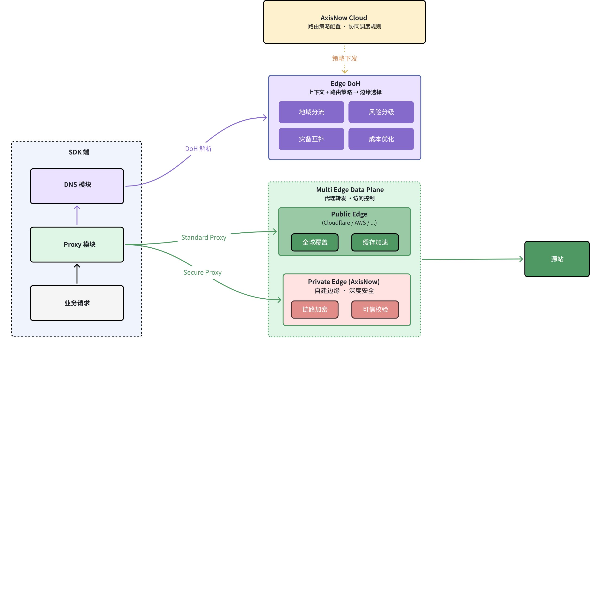

- **地域分流**：大陆用户流量调度至 Private Edge 以获得加密链路和合规保障，海外用户流量调度至就近的 Public Edge 以获得最低延迟
- **风险分级**：高风险设备的流量强制经由 Private Edge 进行深度校验，低风险设备的常规流量则可直接走 Public Edge（详见前文"基于上下文的节点隔离"）
- **灾备互补**：Public Edge 与 Private Edge 互为灾备，故障时流量自动切换（详见前文动态接入与故障切换）
- **成本优化**：根据流量类型和业务优先级，将高价值流量分配给 Private Edge，将大流量静态资源分配给成本更优的 Public Edge

这种多边缘协同模型让企业无需在"单一 CDN 绑定"和"自建全部基础设施"之间做二选一的抉择——而是根据业务需求灵活组合，在安全性、性能、成本和合规之间取得最优平衡。

#### 去中心化机制

前述各节介绍的调度域名兜底、Edge DoH 分布式解析、多边缘协同与 SDK 本地决策，共同构成了 AxisNow 的去中心化接入能力——关键能力分散在多个独立节点上，任何单一节点的失效都不会导致系统不可用。

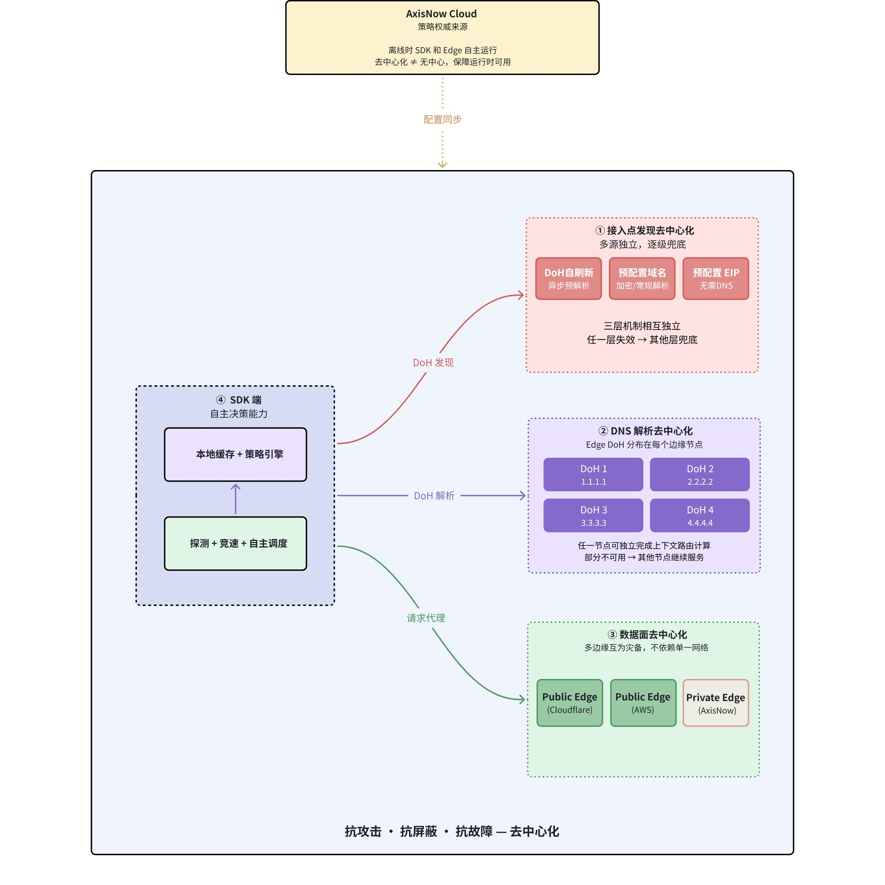

这一去中心化设计贯穿前述各层架构：

- 接入点发现：SDK 通过多层兜底设计（Edge DoH 自刷新 → 预配置域名 → EIP 直连）从多个独立途径获取节点列表，即使部分 IP 或域名被屏蔽，仍可通过其他途径完成接入（详见前文"调度域名"）
- DNS 解析：Edge DoH 运行在每个 Private Edge 节点上，每个节点都能独立完成上下文路由计算，任意一个可达即可提供服务，攻击者无法通过攻击单一节点瘫痪解析能力
- 数据面：Data Plane 由 Public Edge 与 Private Edge 共同组成，不依赖单一边缘网络，互为灾备，部分节点故障时流量自动切换到其他可用节点（详见前文"动态接入与故障切换"）
- 客户端决策：SDK 在本地缓存配置与节点信息，即使控制面暂时不可达，仍可基于本地策略自主调度流量，维持服务不中断（详见前文"动态接入与故障切换"）

去中心化不意味着无中心。AxisNow Cloud 仍然是全局策略的权威来源和统一管理入口。去中心化解决的是运行时的可用性问题——确保在各种异常场景下，SDK 和边缘网络能够自主维持服务，而非等待中心节点恢复。

## 客户端请求的详细流程示例

让我们通过 2 个例子来演示客户端发出请求的全过程。

### AxisNow Edge DoH（AED）

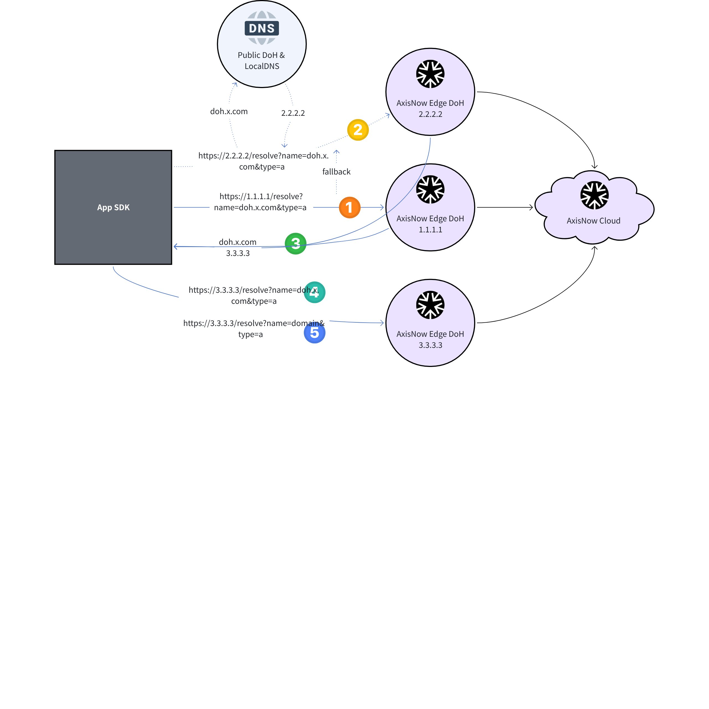

AED 是 AxisNow 边缘 DoH 服务，具备**分布式、高可用、基于策略解析**三大特性。

服务的核心是**通过 EIP 对外提供解析**能力。为了保障客户端始终能拿到一个可用的 EIP，AED 采用了三层兜底的高可用设计：

- **预置 EIP**（图例 `1.1.1.1`）——App SDK 内置的兜底地址作为当前 EIP
- **AED 域名寻址**（图例 `doh.x.com` → `2.2.2.2`）——通过公共 DoH 或 LocalDNS 解析得到
- **策略分配 EIP**（图例 `3.3.3.3`）——AED 定期通过当前 EIP 解析 `doh.x.com`，以便随用户/设备/上下文动态下发的最优 EIP

#### 完整请求流程

整个流程分为两个阶段：**冷启动获取最优 EIP**（步骤 ①–③）和**稳态运行**（步骤 ④–⑤）。

##### 阶段一：冷启动获取最优 EIP

**① 优先使用预置 EIP 直连解析**

App 启动后，首先用内置的 EIP（`1.1.1.1`）直接发起 DoH 请求，解析 AED 域名：

```text
https://1.1.1.1/resolve?name=doh.x.com&type=a
```

- 解析成功 → 直接跳至步骤 ③
- 解析失败 → 回退至步骤 ②

**② 兜底：通过公共解析寻址 AED 域名**

当预置 EIP 不可用时，回退到 Public DoH 或 LocalDNS 解析 `doh.x.com`，得到一个备用 EIP（图例 `2.2.2.2`），再用它重新发起 DoH 请求：

```text
https://2.2.2.2/resolve?name=doh.x.com&type=a
```

**③ AED 基于策略下发专属 EIP**

无论走 ① 还是 ②，AED 都会结合当前 AED 域名/用户/设备/网络等上下文，返回一个最优的 EIP（图例 `3.3.3.3`）。这个 EIP 将成为客户端后续所有解析请求的主用入口。

##### 阶段二：稳态运行

**④ 周期性刷新最优 EIP**

客户端定期通过当前 EIP 重新解析 `doh.x.com`，以便随上下文变化滚动更新到更优的 EIP：

```text
https://3.3.3.3/resolve?name=doh.x.com&type=a
```

**⑤ 业务域名解析复用同一 EIP**

所有业务域名的解析请求都通过策略下发的 EIP 完成，AED 同样基于策略规则返回对应的解析记录：

```text
https://3.3.3.3/resolve?name={domain}&type=a
```

#### 设计要点

- **多层兜底保可用**：预置 EIP → 公共解析 → 策略 EIP，任何一层失效都不会阻塞客户端起步
- **上下文感知**：同一个 `doh.x.com`，不同客户端、不同时间、不同网络可能拿到完全不同的 EIP，从而实现就近接入与流量调度
- **持续优化**：稳态期通过周期性解析 `doh.x.com` 让 EIP 分配随上下文动态调整，而非一次性决定

### 业务域名的请求处理

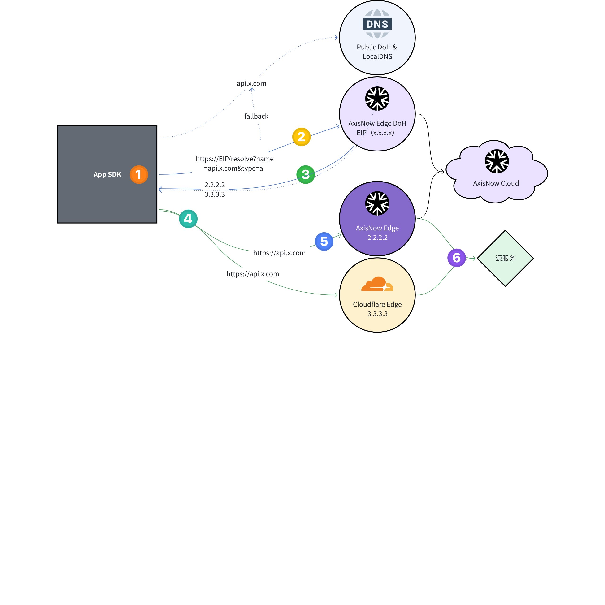

业务域名是应用实际访问的目标域名（如 `api.x.com`），由 SDK 接管 DNS 解析与流量转发。SDK 内部由两个模块协作：**DNS 模块**负责域名解析与节点寻址，**Proxy 模块**负责按策略分流与建立连接。

#### ① 应用发起业务请求

应用按常规方式调用业务 API（如 `https://api.x.com/...`），无需感知 AxisNow 的存在。所有改造都在 SDK 集成层完成（如 OkHttp / URLSession 注入本地 Proxy），对上层应用完全透明。

#### ② DNS 模块发起域名解析

SDK 内的 DNS 模块向 **AxisNow Edge DoH（AED）** 发起解析请求，并携带上下文（时间、设备信息、网络环境、风险评级、目标域名等）用于路由决策：

```text
https://{EIP}/resolve?name=api.x.com&type=a
```

> **Fallback**：若 AED 不可达，DNS 模块自动回退到 Public DoH 或 Local DNS 解析 `api.x.com`，确保解析链路不中断。

#### ③ AED 返回最优数据面节点

AED 根据上下文与控制台下发的路由规则，动态计算并返回最优数据面节点地址。例如：

- 大陆流量返回**私有边缘节点**（图例 `2.2.2.2`，AxisNow Edge）
- 海外流量返回**公有 CDN 节点**（图例 `3.3.3.3`，Cloudflare Edge）

> Fallback 路径下，Public DoH / LocalDNS 返回的是 `api.x.com` 的标准 DNS 记录，不具备基于上下文的策略路由能力，但能保障基本连通性。

#### ④ Proxy 模块判断分流并选择接入模式

拿到解析结果后，Proxy 模块判断该域名是否在 **AxisNow 接管范围**（由控制台配置）内：

- **接管 + 私有边缘节点** → 启用 **Secure Proxy 模式**，与 AxisNow Edge 建立加密隧道，防止流量被外部嗅探
- **接管 + 公有边缘节点** → 启用 **Standard Proxy 模式**，在标准 HTTPS 请求中注入 JWT Token，经 Cloudflare Edge 转发
- **不在接管范围** → SDK 不介入，请求按操作系统原生网络栈正常发出

#### ⑤ 数据面节点接收并校验请求

- **Secure Proxy 模式**：AxisNow Edge 终止加密隧道，完成请求解封装与鉴权
- **Standard Proxy 模式**：Cloudflare Edge 校验 JWT Token，确认请求合法性

#### ⑥ 数据面节点回源至业务后端

数据面节点按控制台配置的回源策略将请求转发至您的**源服务**，并把响应原路返回应用。

## 最常见的用例

我们最常见到以下驱动因素：

- **主动防御 DDoS 和 CC 攻击**

    以零信任的思想缩小攻击面和实施应用可信访问。

- **防止域名劫持和屏蔽**

    消除 DNS 解析劫持和屏蔽，确保服务的高可用。

- **移动应用业务安全**

    防止 API 密钥泄露，防御中间人攻击，识别和阻止不安全的设备环境、篡改应用。

- **加快客户端访问速度**

    基于应用端 SASE 网络提高跨境和全球用户的访问速度。

- **主动数字体验监控**

    提供全链路追踪和可见性，以便快速进行故障排除、修复和主动性能优化。

## 部署和集成

!!! tip
    AxisNow 被设计成一个您可以轻松自我部署的产品。我们的设计目标是在 1 个小时内完成初始化部署。

### 平台侧配置

1. 部署或订阅 Edge 节点
2. 在控制台创建 SDK 集成参数（获取 AccessKey ID / Secret 和 Edge DoH 接入节点列表）
3. 在控制台添加 DoH 路由规则和资源配置

### 客户端集成（Quickstart）

SDK 集成只需两步，即可让应用获得可信解析与多边缘接入能力。以下以 Android (Kotlin) 为例：

```kotlin
// Step 1 — 初始化 SDK（应用启动时调用）
val config = AgentConfig.Builder()
    .accessKeyId("your-access-key-id")
    .accessKeySecret("your-access-key-secret")
    .edgeNodes(listOf("1.1.1.1", "doh.acme.com"))
    .build()
AgentSDK.init(applicationContext, config)

// Step 2 — 将网络请求接入 SDK（推荐 axhttp 零侵入接入）
val client = AXHTTPService.getOkHttpClient()
val response = client.newCall(
    Request.Builder().url("https://api.app.com/v1/data").build()
).execute()
```

核心集成代码不到 15 行，无需修改业务代码。SDK 同时支持 HTTP / SOCKS5 代理、自定义网络栈等高级接入模式。更多 API 参考与详细接入指南请参见 [指南](../guides/index.md)。

## 总结

本白皮书介绍了 AxisNow 移动/原生应用增强套件的整体架构与工作原理。AxisNow 通过在客户端嵌入轻量 SDK，将 DNS 解析、流量路由与安全校验的决策点从中心化的云端前移至设备侧与边缘侧，构建了一条由 SDK、Edge DoH 与 Multi-Edge 数据面共同组成的可信接入链路。

这一架构带来了几项核心价值：基于设备上下文的智能路由与节点隔离，让安全策略在 DNS 解析层面即可生效；Private Edge 与 Public Edge 的多边缘协同，让企业在安全性、性能、成本与合规之间灵活取舍；去中心化的多层兜底设计，确保在节点故障、DNS 劫持或网络受限等极端场景下，系统仍能自主维持服务。

同时，AxisNow 将集成复杂度降到最低——客户端两步接入、平台侧一小时部署，业务代码几乎无需改动。

我们相信，应用安全与网络加速不应是一道非此即彼的选择题。AxisNow 的目标是为每一个移动和原生应用提供一层透明、可控、可演进的网络基础设施，让开发者专注于业务本身，而非底层网络的复杂性。
