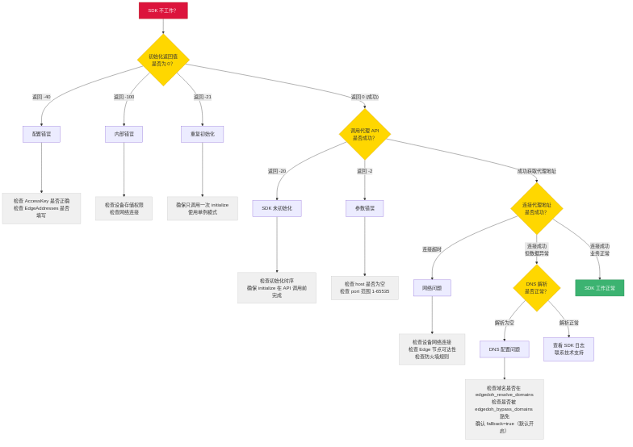

# 错误处理与排障指南

> **受众**: 应用开发者
> **前置阅读**: [接入指南](../guides/index.md)

---

## 目录

- [1. 排障流程](#1-排障流程)
- [2. 常见问题排查](#2-常见问题排查)
- [3. 平台特有问题](#3-平台特有问题)
- [4. 最佳实践](#4-最佳实践)

错误码完整定义见 [参考 / 错误码](../reference/errors.md)。

---

## 1. 排障流程

遇到 SDK 问题时，按以下流程排查：



**快速排查步骤**：

1. **检查初始化返回值**：`initialize` 是否返回 `0`？
2. **检查 API 返回值**：`getLocalHTTPProxy` / `getLocalSocks5Proxy` 是否返回有效结果？
3. **检查网络连接**：设备是否能访问 Edge 节点？
4. **检查 DNS 配置**：`EdgeDohResolveDomains` / `EdgeDohBypassDomains` 配置是否符合预期？
5. **查看 SDK 日志**：日志中通常包含详细的错误原因

---

## 2. 常见问题排查

### 2.1 初始化失败

#### AccessKey / edgeNodes 类（`-112` / `-113` / `-114` / `-115`）

**现象**：`initialize` 返回 `-112` ~ `-115`

**排查**：
- `-112` `AccessKeyIDMissing`：配置里 `accessKeyId` 没填或填了空字符串
- `-113` `AccessKeySecretMissing`：`accessKeySecret` 没填或填了空字符串
- `-114` `AccessKeyInvalid`：值填了但解析失败 —— 可能复制时漏了字符、加了空白、用错了凭证；从控制台重新复制
- `-115` `EdgeAddressEmpty`：`edgeNodes` 是空数组或全是空字符串；至少配置一个有效地址

#### 配置 JSON 错误（`-111` `InvalidConfig`）

**现象**：`initialize` 返回 `-111`

**排查**：
- JSON 格式错误（多余逗号、缺少引号、类型不匹配等）
- 字段类型与 [参考 / 初始化参数](../reference/init-parameters.md) 定义不符

#### 内部错误（`-50` `Internal`）

**现象**：`initialize` 返回 `-50`

**排查**：
- **Android**：检查应用是否有存储权限，`filesDir` 是否可写
- **iOS**：检查应用沙箱目录是否可访问
- 检查设备 keystore / keychain 是否可用

#### 重复初始化（`-102` `AlreadyInitialized`）

**现象**：`initialize` 返回 `-102`

**排查**：
- 确认 `initialize` 只被调用了一次
- Android 中注意 `Application.onCreate` 可能在多进程下被调用多次，需做进程判断

> **重要**：初始化失败后，SDK 会缓存错误，再次调用不会重试。必须**重启应用进程**后重新初始化。

### 2.2 代理连接问题

#### 获取代理地址失败

**现象**：`getLocalHTTPProxy` / `getLocalSocks5Proxy` 返回 `null` 或负数错误码

**排查**：
- `-101` `NotInitialized`：SDK 未初始化，检查初始化时序
- `-301` `ProxyListenerUnavailable`：代理 listener 通用故障（含 iOS 后台 socket 重建失败），尝试重启 SDK
- `-311` `ProxyAddrInUse`：端口被占用，三层重试 + OS-assign 后仍失败 —— 通常是同设备多进程竞争或系统 TIME_WAIT 堆积，重启进程
- `-321` `ProxyFDExhausted`：FD 耗尽，排查应用是否泄漏了文件/连接，必要时调高 ulimit
- `-331` `ProxyPermissionDenied`：监听权限被拒（罕见）—— 沙箱或安全策略限制，反馈给运维

#### 获取代理地址成功，但连接超时

**排查**：
- 确认设备网络正常（能否 ping 通 Edge 地址？）
- 检查 `edgeNodes` 中的地址是否正确
- 检查是否有防火墙或代理规则阻断了 SDK 到 Edge 的连接
- 尝试配置多个 Edge 地址以启用竞速容灾

### 2.3 DNS 解析异常

#### 解析结果为空

**排查**：
- 确认域名拼写正确
- 检查域名是否命中 `EdgeDohResolveDomains`（精确 / `*.suffix` 通配）
- 检查域名是否被 `EdgeDohBypassDomains` 意外豁免（bypass 优先级高于 resolve）
- 如果走 EdgeDoH 路径，检查 Edge 节点是否可达
- 确认 fallback 默认开启，允许 hedged 兜底到系统 DNS

#### 解析延迟高

**排查**：
- 检查是否配置了 `pre_resolve_hosts` 预解析常用域名
- 检查 `min_cache_ttl` 是否过低（建议 ≥ 60 秒）
- 如果命中 EdgeDoH 路径，Edge 节点的网络延迟可能影响解析速度

---

## 3. 平台特有问题

### 3.1 Android

| 问题 | 原因 | 解决方案 |
|------|------|---------|
| 初始化崩溃 | 缺少 `INTERNET` 或 `ACCESS_NETWORK_STATE` 权限 | 在 `AndroidManifest.xml` 中添加权限声明 |
| ProGuard 混淆后异常 | SDK 类被混淆 | 添加 ProGuard 规则保留 `com.axsecurity.**` |
| 多进程重复初始化 | `Application.onCreate` 在每个进程都执行 | 判断当前进程，仅在主进程初始化 |
| AAR 找不到 | 依赖配置不正确 | 确认 `libs/` 目录下有 `.aar` 文件，`build.gradle` 包含 `fileTree` 依赖 |

**ProGuard 规则示例**：
```proguard
-keep class com.axsecurity.** { *; }
-dontwarn com.axsecurity.**
```

### 3.2 iOS

| 问题 | 原因 | 解决方案 |
|------|------|---------|
| 链接错误 | 缺少系统库依赖 | 确认链接了 `libz.tbd`、`libc++.tbd`、`libresolv.tbd`、`DeviceCheck.framework`、`CoreTelephony.framework` |
| ATS 阻断请求 | App Transport Security 策略 | 对需要代理的域名配置 ATS 例外，或确认使用 HTTPS |
| Bitcode 编译失败 | Framework 不支持 Bitcode | 在 Build Settings 中关闭 Bitcode（`Enable Bitcode = NO`） |
| 最低版本不满足 | 工程 Deployment Target < iOS 12 | 将最低部署目标设为 iOS 12.0 |

### 3.3 Flutter

| 问题 | 原因 | 解决方案 |
|------|------|---------|
| `PlatformException` | 原生层初始化失败 | 检查 Android/iOS 平台的原生配置是否完成 |
| `MissingPluginException` | 插件未正确注册 | 执行 `flutter clean && flutter pub get` |
| iOS 编译失败 | 缺少系统库 | 在 iOS Runner 工程中链接所需系统库 |
| 热重载后状态丢失 | SDK 在原生层，不受 Dart 热重载影响 | SDK 状态在进程级别保持，热重载不影响 |

---

## 4. 最佳实践

### 4.1 初始化

- **尽早初始化**：在应用启动时立即调用（Android `Application.onCreate` / iOS `didFinishLaunchingWithOptions`），为后续 API 调用做好准备
- **只调用一次**：使用单例模式或全局标志位，确保 `initialize` 不会被重复调用
- **检查返回值**：初始化失败时记录日志，但不要阻断应用启动流程

### 4.2 Edge 节点配置

- **至少配置 2 个地址**：启用多节点竞速和容灾
- **混合域名和 IP**：域名有更好的灵活性（可通过 DNS 切换后端），IP 在 DNS 不可用时仍可直连

### 4.3 DNS 配置

- **生产环境开启 fallback**：`fallback: true`（默认开启），确保 EdgeDoH 不可达时仍有 hedged 系统 DNS 兜底
- **过期缓存兜底**：`enable_expired_ip` 默认已开启，网络抖动时使用过期缓存 IP 维持服务
- **预解析关键域名**：将首屏需要访问的域名加入 `pre_resolve_hosts`
- **业务域名启用 EdgeDoH**：把需要防劫持的域名加入 `EdgeDohResolveDomains`（注意：默认不启用，需显式配置）
- **特殊域名豁免**：登录域名等需保持系统 DNS 行为的，加入 `EdgeDohBypassDomains`（bypass 优先于 resolve）

### 4.4 错误处理

- **不要 crash**：SDK API 返回错误时应降级处理，而非让应用崩溃
- **记录日志**：记录 SDK 返回的错误码，便于排障
- **重启重试**：初始化失败后需重启进程重试，不要在同一进程中反复调用
